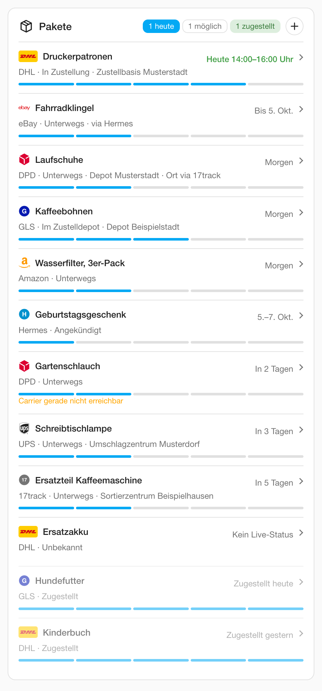
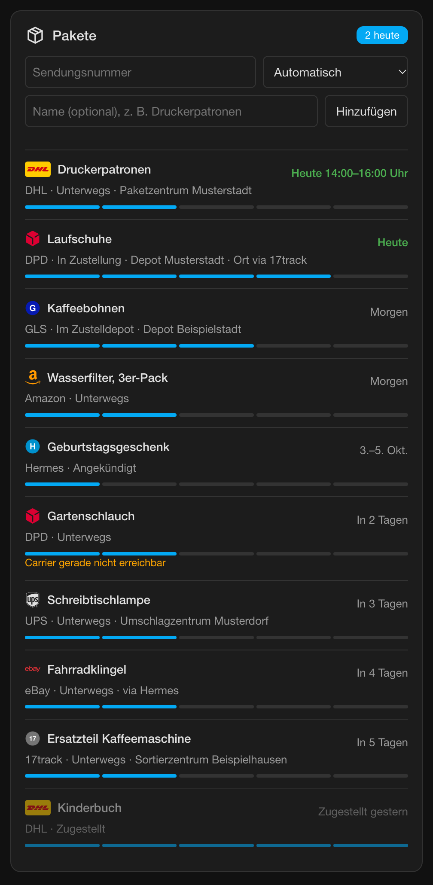

# Paket Tracker

Paket Tracker ist eine Integration für Home Assistant. Sie verfolgt Pakete von DHL, DPD, GLS, Hermes und (optional) UPS, übernimmt Pakete aus E-Mails von Amazon, eBay, AliExpress und den Paketdiensten und zeigt alles auf einer eigenen Dashboard-Karte.

Du siehst an einer Stelle: Kommt heute ein Paket, und wann?

{ width="300" }
{ width="300" }
{ width="300" }

Die Bilder zeigen erfundene Pakete: Namen, Orte und Sendungsnummern sind ausgedacht. Du kannst die Karte ohne Home Assistant ausprobieren: [Demo-Karte öffnen](demo/index.html).

## Für wen?

- Du nutzt Home Assistant und bekommst regelmäßig Pakete.
- Du wohnst in Deutschland. Die Integration ist für deutsche Paketdienste und deutsche Mails gebaut.
- Du willst Pakete in Automationen nutzen: Ansage am Morgen, Meldung an der Paketbox, Licht als Anzeige.

Im Ausland funktionieren DHL (offizielle API, weltweit), UPS (offizielle API) und jeder Paketdienst über 17track. Der Mail-Import versteht nur deutsche Mails. Für Österreich und die Schweiz gibt es eine eigene Einstellung, siehe [Österreich und Schweiz](dienste.md#osterreich-und-schweiz).

## Warum?

Ich war es leid, ständig in verschiedenen Apps Zustelltage und -zeiten zu checken. Ich wollte in Home Assistant an einer Stelle sehen: „Kommt heute ein Paket, und wann?“ – für alle Paketdienste zusammen, statt in fünf Apps und einem Stapel Mails zu suchen.

## Was es kann

- **Pakete erscheinen von selbst.** Die Integration liest die Versandmails aus einem eigenen Paket-Postfach und legt die Pakete an. Das gilt auch für Amazons eigene Lieferungen, für die es keine öffentliche Sendungsverfolgung gibt.
- **Live-Status vom Paketdienst.** DPD, GLS und Hermes brauchen dafür nichts. DHL braucht einen kostenlosen API-Key, UPS einen eigenen Entwicklerzugang. Beides ist optional.
- **Eine Karte für alles.** Pakete hinzufügen, umbenennen, entfernen. Status, Liefertag, Zeitfenster und Verlauf stehen in einer Liste.
- **Benachrichtigung aufs Handy.** Sobald ein Paket in Zustellung geht, zugestellt ist oder zur Abholung bereitliegt. Eine Automation brauchst du dafür nicht.
- **Für Automationen gemacht.** Fertige Auslöser im Automations-Editor, ein Status-Event, ein Kalender mit den Lieferterminen und Sensoren wie „Pakete heute“.
- **Namen ausblenden.** Ein Schalter für Geschenke auf einem gemeinsamen Dashboard: Pakete heißen dann nur noch nach dem Paketdienst.
- **Lokal und datensparsam.** Kein Cloud-Konto, kein fremder Tracking-Dienst nötig. Die Zugangsdaten bleiben in Home Assistant.
- **Weitere Paketdienste auf Wunsch.** Mit einem eigenen 17track-Key verfolgst du auch Paketdienste ohne eigene Anbindung, z. B. FedEx.

Was noch nicht geht, steht unter [Roadmap & Status](stand.md).

## In drei Schritten starten

1. **Installieren.** Die Integration über HACS herunterladen und Home Assistant neu starten. → [Installation](installation.md)
2. **Einrichten.** Unter **Einstellungen → Geräte & Dienste → Integration hinzufügen** „Paket Tracker“ wählen. Alle Felder sind optional oder vorbelegt.
3. **Karte hinzufügen.** Seite einmal neu laden, dann im Dashboard die Karte „Paket Tracker“ hinzufügen und über den Plus-Knopf die erste Sendungsnummer eintragen.

Danach lohnt sich der [E-Mail-Import](mail-import.md): Mit ihm tauchen Pakete von selbst auf.

[Zur Installation](installation.md){ .md-button .md-button--primary }
[Rezepte für Automationen](rezepte.md){ .md-button }
