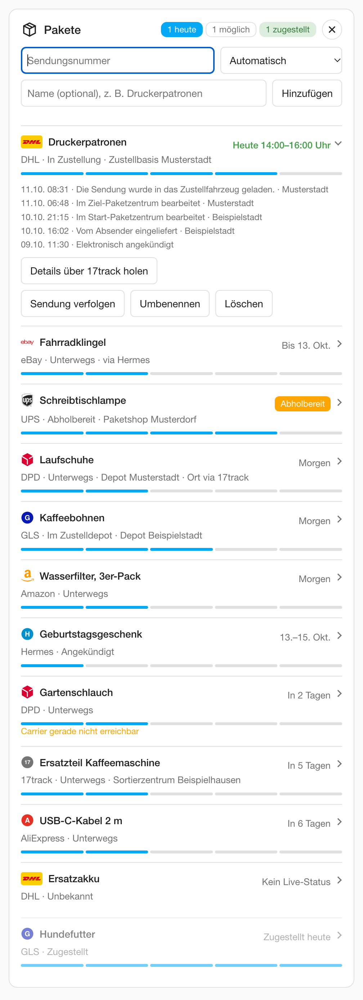

# Die Karte

Die Karte `custom:parcel-tracker-card` kommt mit der Integration. Im Karten-Auswahldialog heißt sie „Paket Tracker“. Wie du sie aufs Dashboard bringst, steht unter [Installation](installation.md#karte-hinzufugen).

{ width="320" }

Zum Ausprobieren ohne Home Assistant: [Demo-Karte öffnen](demo/index.html). Alle Pakete dort sind erfunden.

Die Karte ist deutsch, unabhängig von der Sprache, die in Home Assistant eingestellt ist. Auch die Statusangaben („Unterwegs“, „Zugestellt“ …) kommen aus der Karte selbst.

## Paket hinzufügen

1. Auf den Plus-Knopf oben rechts tippen („Sendung hinzufügen“). Die Eingabe klappt auf.
2. Sendungsnummer eintragen.
3. Carrier wählen: „Automatisch“, DHL, DPD, GLS, Hermes oder UPS. Mit 17track-Key und freiem Kontingent steht dort auch „Andere (über 17track)“.
4. Auf Wunsch einen Namen eintragen, z. B. „Druckerpatronen“.
5. „Hinzufügen“ antippen.

Nach dem Hinzufügen klappt die Eingabe wieder zu. Bei einem Fehler bleibt sie offen und zeigt die Meldung. Ein weiterer Klick auf den Knopf (dann ein ×) oder ++esc++ schließt sie.

!!! note "Hinweis nach dem Hinzufügen"
    Lässt sich der Paketdienst des neuen Pakets nicht abfragen, steht unter der Eingabe eine Zeile in gedämpfter Schrift. Für DHL ohne API-Key:

    „Hinzugefügt. Ohne DHL-API-Key gibt es dafür keinen Live-Status: Key unter „Konfigurieren“ eintragen – oder der Status kommt aus den DHL-Mails über den Mail-Import.“

    Für UPS ohne Zugangsdaten gibt es dieselbe Zeile mit „UPS-Zugangsdaten“. Die Zeile bleibt stehen, bis du sie über das × schließt, das nächste Paket hinzufügst oder das Paket einen Status bekommt. Für Pakete aus Mails erscheint sie nie.

Amazon-Nummern (`TBA…`) lassen sich nicht direkt verfolgen. Dafür ist der [E-Mail-Import](mail-import.md) da.

## Die Schilder oben rechts

Oben rechts stehen bis zu drei Schilder, gelesen aus `sensor.pakete_heute`:

| Schild | Bedeutung | Sichtbar |
|---|---|---|
| „1 heute“ | Kommt heute sicher: in Zustellung oder fester Liefertag heute | immer, auch als „0 heute“ |
| „1 möglich“ | Die Lieferspanne schließt heute ein. In der Liste bleibt die Spanne stehen (z. B. „Bis 5. Okt.“) | nur, wenn es solche Pakete gibt |
| „1 zugestellt“ | Heute zugestellt | nur, wenn heute etwas zugestellt wurde |

- Wird ein Paket zugestellt, wechselt es von „heute“ zu „zugestellt“. Die Karte zeigt dann z. B. „0 heute“ und „1 zugestellt“.
- Eine Bestellung, die ohne Zustellmail abgeschlossen wurde, zählt dabei nicht mit. In der Liste steht bei ihr „Abgeschlossen (ohne Zustellbestätigung)“ statt „Zugestellt …“.
- Die Erklärung steht auch als Tooltip auf jedem Schild.
- Auf schmalen Karten rutschen die Schilder gemeinsam unter den Titel, der Plus-Knopf bleibt rechts.

## Was in einer Zeile steht

Jede Zeile zeigt den Paketdienst, den Namen, den Status, einen Fortschrittsbalken und rechts den Termin:

| Rechts steht | Bedeutung |
|---|---|
| „Heute“ oder „Heute 14:00–16:00 Uhr“ | Liefertag heute, mit Zeitfenster, wenn eines bekannt ist |
| „Morgen“, „In 3 Tagen“ | fester Liefertag |
| „Bis 5. Okt.“ oder eine Spanne | der Versender nennt nur einen Zeitraum |
| „Abholbereit“ | liegt in Packstation, Filiale oder PaketShop |
| „Zugestellt heute“, „Zugestellt gestern“, „Zugestellt am …“ | zugestellt |
| „Abgeschlossen (ohne Zustellbestätigung)“ | Bestellung ohne Zustellmail, siehe [E-Mail-Import](mail-import.md#bestellungen-ohne-zustellmail) |
| „Noch kein Termin“ | Das Paket hat einen Status, aber noch keinen Zustelltag |
| „Termin überschritten“ | Der genannte Liefertag ist vorbei |
| „Kein Live-Status“ | Der Paketdienst lässt sich nicht abfragen, weil der DHL-API-Key oder die UPS-Zugangsdaten fehlen |

## Paket aufklappen

Ein Tipp auf ein Paket klappt es auf. Der kleine Pfeil rechts in der Zeile zeigt das an. Ein weiterer Tipp klappt es wieder zu.

Aufgeklappt siehst du:

**Verlauf**
:   Die Ereignisse der Sendung mit Zeit, Text und – wenn bekannt – Ort.

**Sendung verfolgen**
:   Öffnet die Sendungsverfolgung des Paketdienstes (DHL, DPD, GLS, Hermes, UPS) mit der Sendungsnummer in einem neuen Tab. Den Link gibt es auch bei einer Bestellung, sobald sie die Sendungsnummer des Paketdienstes kennt. Ohne Sendungsnummer eines dieser Paketdienste (Bestellung nur aus Mails, Paket nur über 17track, Paketdienst noch nicht erkannt) gibt es den Link nicht. Es sind die deutschen Seiten der Paketdienste, auch mit Land Österreich oder Schweiz. Die Adresse steht auch im Attribut `tracking_url` des Paket-Sensors.

**Bestellung**
:   Bei einer Amazon-, eBay- oder AliExpress-Bestellung: öffnet die Bestellseite des Shops in einem neuen Tab.

**Details über 17track holen**
:   Nur mit 17track-Key. Meldet das Paket nach einer Rückfrage bei 17track an und ergänzt Ort, Zeitfenster und Verlauf. Verbraucht eine 17track-Nummer, siehe [17track](dienste.md#17track-optional).

**Code anzeigen**
:   Nur, wenn ein Zustell-Code bekannt ist. Erst „Code anzeigen“, dann die Rückfrage „Zustell-Code anzeigen?“. Beim Zuklappen verschwindet er wieder. Siehe [Zustell-Codes](datenschutz.md#zustell-codes).

**Umbenennen**
:   Gibt dem Paket einen eigenen Namen.

**Löschen**
:   Entfernt das Paket, mit Rückfrage „Wirklich löschen?“.

## Optionen der Karte

Die Karte hat zwei eigene Optionen: `add_form` und `show`. Beide trägst du im YAML der Karte ein (Karte bearbeiten).

### `add_form` – die Eingabe

Legt fest, wie die Eingabe für neue Sendungen erscheint.

| Wert | Wirkung |
|---|---|
| `button` (Standard) | Eingabe eingeklappt hinter dem Plus-Knopf |
| `always` | Eingabe immer sichtbar, kein Plus-Knopf |
| `never` | Keine Eingabe und kein Plus-Knopf, z. B. für ein Wand-Tablet. Pakete kommen dann über den Dienst `parcel_tracker.add_parcel` oder den E-Mail-Import |

Fehlt die Option oder steht dort ein anderer Wert, gilt `button`.

=== "button"

    ```yaml
    type: custom:parcel-tracker-card
    add_form: button
    ```

=== "always"

    ```yaml
    type: custom:parcel-tracker-card
    add_form: always
    ```

=== "never"

    ```yaml
    type: custom:parcel-tracker-card
    add_form: never
    ```

### `show` – wann die Karte sichtbar ist

Legt fest, wann die Karte überhaupt auf dem Dashboard steht – z. B. auf der Startseite nur, solange ein Paket unterwegs ist.

| Wert | Karte ist sichtbar |
|---|---|
| `always` (Standard) | immer |
| `active` | solange ein Paket noch nicht zugestellt ist (`sensor.pakete_unterwegs` größer 0) |
| `today` | wenn heute sicher etwas kommt oder heute schon etwas zugestellt wurde |
| `today_possible` | wie `today`, zusätzlich wenn ein Paket heute möglich ist (Lieferspanne schließt heute ein) |

Fehlt die Option oder steht dort ein anderer Wert (Groß- und Kleinschreibung ist egal), gilt `always`.

=== "active"

    ```yaml
    type: custom:parcel-tracker-card
    show: active
    ```

=== "today"

    ```yaml
    type: custom:parcel-tracker-card
    show: today
    ```

=== "today_possible"

    ```yaml
    type: custom:parcel-tracker-card
    show: today_possible
    ```

=== "always"

    ```yaml
    type: custom:parcel-tracker-card
    show: always
    ```

Gut zu wissen:

- Eine ausgeblendete Karte hinterlässt keine Lücke, weder in der Mauerwerk- noch in der Abschnitte-Ansicht.
- Im Bearbeitungsmodus des Dashboards und in der Vorschau des Karten-Editors bleibt sie sichtbar und zeigt die Zeile „Ausgeblendet, solange nichts ansteht (show: …)“.
- Solange die Eingabe über den Plus-Knopf offen ist, verschwindet die Karte nicht.
- Fehlt ein Sensor, den die Option braucht (Integration älter als v0.3.11), bleibt die Karte sichtbar.

### Beide Optionen zusammen

```yaml
type: custom:parcel-tracker-card
add_form: never
show: today_possible
```

### Sichtbarkeit von Home Assistant nutzen

Nutzt du lieber die Sichtbarkeits-Bedingung von Home Assistant (Karte bearbeiten → Reiter „Sichtbarkeit“), nimmst du denselben Sensor. Das geht auch für jede andere Karte:

```yaml
type: custom:parcel-tracker-card
visibility:
  - condition: numeric_state
    entity: sensor.pakete_unterwegs
    above: 0
```

Weitere Beispiele stehen im Rezept [Karte nur zeigen, wenn etwas unterwegs ist](rezepte.md#5-karte-nur-zeigen-wenn-etwas-unterwegs-ist).

## Nach einem Update: Seite neu laden

Nach einem Update der Integration behält der Browser die alte Karte, bis die Seite neu geladen wird.

Die Karte merkt das selbst: Sie vergleicht ihre Version mit dem Attribut `integration_version` von `sensor.pakete_heute` und zeigt dann oben die Zeile „Neue Version installiert – Seite neu laden, um die Karte zu aktualisieren.“ mit dem Knopf „Neu laden“.

Den Hinweis gibt es ab v0.3.9. Eine ältere Karte kennt ihn nicht. Kommst du von einer älteren Version, lädst du die Seite nach dem Update einmal von Hand neu.

Die Kartendatei selbst zu ändern ist nicht nötig. Änderungen daran überschreibt die Integration beim nächsten Start.
